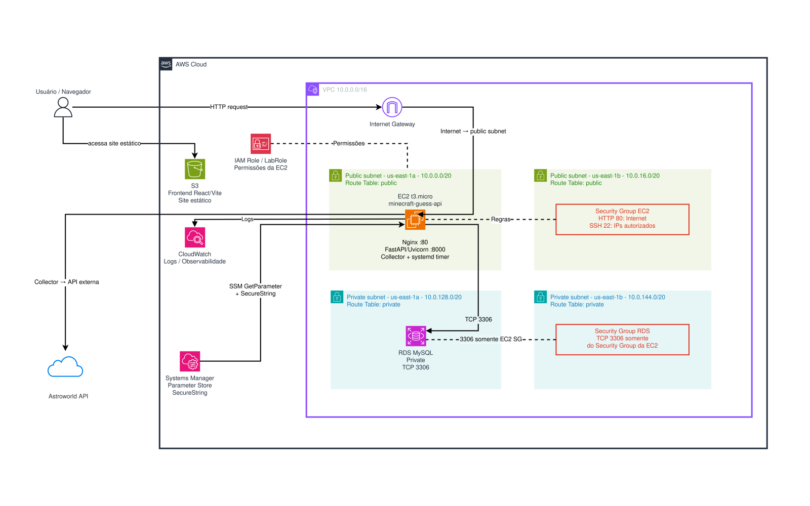

# MinecraftGuess — Guia Completo de Execução e Arquitetura

Bem-vindo ao **MinecraftGuess**! Este documento apresenta uma análise técnica completa da arquitetura do projeto, seu fluxo de dados e o guia detalhado, passo a passo, para execução tanto em **ambiente local de desenvolvimento** quanto na **infraestrutura em nuvem AWS**.

---

## Sumário

1. [Visão Geral do Projeto](#1-visão-geral-do-projeto)
2. [Arquitetura do Sistema](#2-arquitetura-do-sistema)
   - [2.1 Diagrama Geral da Solução](#21-diagrama-geral-da-solução)
   - [2.2 Pipeline de Dados e Ingestão (ETL)](#22-pipeline-de-dados-e-ingestão-etl)
   - [2.3 Modelagem do Banco de Dados (MySQL)](#23-modelagem-do-banco-de-dados-mysql)
   - [2.4 Backend API (FastAPI)](#24-backend-api-fastapi)
   - [2.5 Regras de Negócio e Mecânicas do Jogo](#25-regras-de-negócio-e-mecânicas-do-jogo)
   - [2.6 Frontend Web (React + Vite + Tailwind)](#26-frontend-web-react--vite--tailwind)
   - [2.7 Infraestrutura em Nuvem (AWS)](#27-infraestrutura-em-nuvem-aws)
   - [2.8 Segurança e Governança](#28-segurança-e-governança)
   - [2.9 Observabilidade e Auditoria](#29-observabilidade-e-auditoria)
   - [2.10 Trade-offs e Decisões de Custos (FinOps)](#210-trade-offs-e-decisões-de-custos-finops)
3. [Estrutura de Diretórios](#3-estrutura-de-diretórios)
4. [Como Rodar o Projeto Localmente](#4-como-rodar-o-projeto-localmente)
   - [4.1 Pré-requisitos](#41-pré-requisitos)
   - [4.2 Configuração do Banco de Dados (MySQL)](#42-configuração-do-banco-de-dados-mysql)
   - [4.3 Configuração e Carga Inicial do Backend](#43-configuração-e-carga-inicial-do-backend)
   - [4.4 Configuração e Execução do Frontend](#44-configuração-e-execução-do-frontend)
   - [4.5 Executando os Testes Automatizados](#45-executando-os-testes-automatizados)
5. [Como Funciona o Deploy na AWS](#5-como-funciona-o-deploy-na-aws)
   - [5.1 Configuração da Instância EC2](#51-configuração-da-instância-ec2)
   - [5.2 Configuração do Agendamento do Coletor via Systemd](#52-configuração-do-agendamento-do-coletor-via-systemd)
   - [5.3 Configuração do CloudWatch Agent](#53-configuração-do-cloudwatch-agent)
   - [5.4 Hospedagem do Frontend no S3 / CloudFront](#54-hospedagem-do-frontend-no-s3--cloudfront)
6. [Referência dos Endpoints da API](#6-referência-dos-endpoints-da-api)

---

## 1. Visão Geral do Projeto

O **MinecraftGuess** é um jogo interativo de adivinhação baseado no universo de Minecraft (inspirado em jogos de deduções sucessivas no estilo Wordle). O projeto foi concebido para a disciplina de **Redes de Computadores (GCT0149)** com foco prático na construção de uma arquitetura em nuvem segura, modular, observável e economicamente viável na **Amazon Web Services (AWS)**.

### Principais Características
- **Consumo de API Externa:** Coleta automatizada de dados da API pública Astroworld (`mobs`, `biomes`, `items`, `structures` e `enchantments`).
- **Normalização e Validação Rigorosa:** Tipagem com Pydantic v2 e armazenamento relacional estruturado no MySQL.
- **Enriquecimento e Localização:** Tradução oficial para o português do Brasil (`pt-BR`) e catálogo com 100% de cobertura de imagens da *Minecraft Wiki*.
- **Mecanismos de Jogo Protegidos:** Dedução gradual com sistema de corações (vidas), dicas inteligentes à prova de *spoiler*, e busca com *autocomplete* e *fuzzy matching*.
- **Arquitetura de Rede Segura:** RDS em sub-rede estritamente privada, EC2 em sub-rede pública com Nginx reverso, segredos gerenciados via AWS Systems Manager Parameter Store.

---

## 2. Arquitetura do Sistema

### 2.1 Diagrama Geral da Solução

O diagrama a seguir detalha a topologia em nuvem da aplicação:



---

### 2.2 Pipeline de Dados e Ingestão (ETL)

O componente **Collector** (`backend/collector/`) é responsável por manter o catálogo de entidades atualizado:

1. **Extração:** Conecta-se à API pública Astroworld (`https://api.astroworldmc.com/v1/{endpoint}`) consumindo 5 endpoints:
   - `/mobs`
   - `/biomes`
   - `/items`
   - `/structures`
   - `/enchantments`
2. **Transformação e Validação:** Cada item é validado com modelos Pydantic (`Mob`, `Biome`, `Item`, `Structure`, `Enchantment`).
3. **Carga e Persistência:** Utiliza o padrão Repository (`mob_repository.py`, `biome_repository.py`, etc.) para persistir dados na tabela genérica `entities` e em suas tabelas filhas especializadas.
4. **Auditoria de Execução:** Cada execução gera um registro em `ingestion_runs` com status (`running`, `success`, `partial`, `failed`). Falhas em itens individuais não interrompem o processo e são registradas na tabela `ingestion_errors` com o payload original e mensagem de erro.
5. **Agendamento em Produção:** O coletor é disparado diariamente via `systemd timer` dentro da própria instância EC2, eliminando custos de infraestruturas serverless adicionais.

---

### 2.3 Modelagem do Banco de Dados (MySQL)

O banco de dados relacional utiliza o conjunto de caracteres `utf8mb4` com *collation* `utf8mb4_unicode_ci`.

#### Estrutura das Tabelas Principais:

- **`entities`**: Tabela base de herança relacional. Guarda atributos universais:
  - `id` (PK), `external_id`, `entity_type` (`mob`, `biome`, `item`, `structure`, `enchantment`), `name`, `category`, `version_added`, `notes`, `raw_payload` (JSON) e timestamps.
- **Tabelas Específicas por Tipo**:
  - `mobs`: `hp`, danos (`damage_easy`, `damage_normal`, `damage_hard`), `xp_min`, `xp_max`, `spawn_conditions`, `behavior`, `tameable`, `breedable`, etc.
  - `mob_drops`: Tabela 1:N ligada a `mobs` contendo `item_name`, `count_min`, `count_max`, `chance_raw`.
  - `biomes`: `dimension`, `temperature`, `precipitation`, `rarity`, cores em hexadecimal (`color_grass`, `color_water`, etc.).
  - `items`: `stack_size`, `durability`, `description`, `enchantable`, valores nutricionais (`food_hunger`, `food_saturation`), combustível e receita de crafting.
  - `structures`: `dimension`, `rarity`, coordenadas de altitude (`y_min`, `y_max`), guia de localização.
  - `structure_loot`: Tabela 1:N com itens saqueáveis em estruturas e suas probabilidades.
  - `enchantments`: `max_level`, `description`, `weight`, `treasure_only`, `curse_of`.
  - `entity_list_values`: Normalização de listas de propriedades dinâmicas por entidade.
- **Tabelas de Auditoria de Ingestão**:
  - `ingestion_runs`: Contabilidade de registros recebidos, aceitos e rejeitados.
  - `ingestion_errors`: Detalhes de exceções de validação ou persistência.
- **Enriquecimento e Catálogo**:
  - `entity_translations`: Mapeamento de traduções (`entity_id`, `locale = 'pt-BR'`, `translated_name`, `source`).
  - `entity_media`: Mapeamento de mídia da Minecraft Wiki (`entity_id`, `source = 'minecraft_wiki'`, `file_name`, `image_url`, `license_note`).
- **Mecânicas de Jogo**:
  - `games`: Partida ativa (`id` em UUID v4, `secret_entity_id`, `requested_category`, `lives_remaining`, `status` ['playing', 'won', 'lost'], `finished_at`).
  - `game_guesses`: Histórico de palpites enviados pelo jogador (`game_id`, `guess_text`, `correct`, `created_at`).
  - `game_hints`: Histórico de dicas desbloqueadas para a partida (`game_id`, `hint_number`, `hint_text`).

---

### 2.4 Backend API (FastAPI)

Desenvolvido em Python 3.10+ utilizando **FastAPI**, **SQLAlchemy 2.0** e **Uvicorn**:
- **Design stateless da API:** O estado do jogo reside 100% no banco de dados MySQL, permitindo fácil escalabilidade vertical ou horizontal da camada de aplicação.
- **Transacionalidade e Concorrência:** O método `submit_guess` e `reveal_hint` utilizam transações com bloqueio pessimista (`FOR UPDATE`) para garantir consistência em jogadas simultâneas.
- **Validação com Pydantic:** Schemas tipados garantem sanitização das entradas e formatação adequada das respostas JSON.

---

### 2.5 Regras de Negócio e Mecânicas do Jogo

O arquivo `backend/app/game_service.py` concentra a inteligência do jogo:

1. **Início da Partida:**
   - O jogador escolhe uma categoria específica ou "Aleatório".
   - Uma entidade secreta é sorteada aleatoriamente (`ORDER BY RAND() LIMIT 1`).
   - O jogo inicia com **10 Vidas** (equivalente a 5 corações cheios do Minecraft).
2. **Submissão de Palpites (`/games/{id}/guess`):**
   - Suporte bilíngue: O palpite pode ser submetido tanto em **inglês** quanto em **português (pt-BR)**.
   - Normalização textual: Remoção de acentos (`NFKD`), conversão para minúsculas e supressão de espaços múltiplos (ex.: `"Vaca Cogumelo"` equivale a `"vaca cogumelo"` ou `"VACA"`).
   - Se o palpite estiver correto: O status muda para `'won'` e a identidade secreta, bem como sua imagem, são reveladas.
   - Se o palpite estiver incorreto: O jogador perde **1 Vida**. Se as vidas chegarem a 0, o jogo é marcado como `'lost'` e a entidade é revelada.
3. **Sistema de Dicas Progressivas (`/games/{id}/hint`):**
   - É possível solicitar até **5 dicas** por partida.
   - **Custo de Dica:** Cada dica custa **1 Vida**.
   - **Proteção de Vida Mínima:** É obrigatório possuir pelo menos **2 Vidas** para pedir uma dica (evita que o jogador perca o jogo por comprar uma dica).
   - **Proteção Contra Vazamentos (*Anti-leak*):** Algoritmos de sanitização garantem que nenhuma dica contenha o nome da entidade (nem em inglês, nem em português).
4. **Mecanismo de Autocomplete / Sugestões (`/entities/suggestions`):**
   - Busca em tempo real por entidades conforme o usuário digita.
   - Ordenação inteligente por relevância:
     - Prioridade 0: Correspondência exata.
     - Prioridade 1: Prefixo (começa com o termo digitado).
     - Prioridade 2: Substring (contém o termo digitado).
     - Prioridade 3: Correspondência aproximada (*fuzzy matching* usando `difflib.SequenceMatcher`).

---

### 2.6 Frontend Web (React + Vite + Tailwind)

Interface moderna, responsiva e tematizada com a identidade visual de Minecraft:
- **Componentização:**
  - `CategoryCard`: Seleção de categoria na página inicial com ícones pixelados.
  - `Lives`: Indicador gráfico de saúde com corações cheios, pela metade e vazios.
  - `GuessHistory`: Lista visual com os palpites tentados.
  - `HintList`: Exibição das pistas liberadas e botão para desbloqueio com custo de vida.
  - `AnswerImage`: Renderização da arte oficial da entidade ao término da partida.
- **Tipografia e Estilo:** Fonte clássica pixel art `Monocraft.ttf`, texturas de fundo em padrão de blocos de grama/terra e botões 3D retro com Tailwind CSS.
- **Tratamento de Rede:** `gameApi.ts` desacopla as chamadas REST, suporta debounce no autocomplete e tratamento amigável de erros de API.

---

### 2.7 Infraestrutura em Nuvem (AWS)

A infraestrutura foi projetada para obedecer às diretrizes do *Well-Architected Framework* da AWS:

- **Amazon VPC (10.0.0.0/16):**
  - **Subnet Pública (`10.0.0.0/20` e `10.0.16.0/20`):** Associada à Route Table com rota padrão `0.0.0.0/0` direcionada ao **Internet Gateway (IGW)**. Hospeda a instância EC2.
  - **Subnet Privada (`10.0.128.0/20` e `10.0.144.0/20`):** Sem rota para o Internet Gateway. Hospeda as instâncias de banco de dados do **Amazon RDS**.
- **Amazon EC2 (t3.micro - Linux):**
  - Servidor web **Nginx** na porta 80 atuando como Proxy Reverso para o **Uvicorn** rodando na porta 8000.
  - Serviço e timer do **systemd** para disparo diário da rotina de coleta do Astroworld.
- **Amazon RDS (MySQL):**
  - Instância isolada da internet pública, garantindo que o banco de dados não sofra varreduras ou ataques externos diretos.
- **Amazon S3 (Static Website Hosting):**
  - Bucket configurado para entrega dos artefatos estáticos (HTML/CSS/JS) compilados pelo Vite.

---

### 2.8 Segurança e Governança

- **Isolamento via Security Groups:**
  - **Security Group da EC2:** Permite tráfego HTTP de entrada (porta 80) e SSH restrito (porta 22) apenas a IPs autorizados.
  - **Security Group do RDS:** Regra de entrada para a porta 3306 configurada para aceitar pacotes **exclusivamente provenientes do Security Group da EC2**.
- **AWS Systems Manager (Parameter Store):**
  - Elimina credenciais em texto plano no código-fonte.
  - As variáveis de conexão (`DB_HOST`, `DB_USER`, `DB_PASSWORD`, `DB_NAME`) são salvas como parâmetros do tipo `SecureString` no SSM e injetadas na EC2 via política IAM de menor privilégio (`LabRole`).

---

### 2.9 Observabilidade e Auditoria

A aplicação possui rastreabilidade em todas as suas camadas:
1. **CloudWatch Agent:** Instalado na EC2 e configurado via `deploy/cloudwatch/cloudwatch-agent.json`, transmitindo em tempo real para os Log Groups:
   - `/minecraft-guess/nginx/access`: Acessos HTTP e latência.
   - `/minecraft-guess/nginx/error`: Falhas de proxy ou requisições malformadas.
   - `/minecraft-guess/collector`: Histórico das coletas agendadas da API Astroworld.
   - `/minecraft-guess/api-systemd`: Logs de execução do serviço FastAPI via systemd.
2. **Scripts de Auditoria Inclusos no Projeto:**
   - `audit_hints.py`: Valida se todas as entidades geram dicas suficientes e sem vazamentos.
   - `audit_localization.py`: Audita a integridade do catálogo de nomes em português.
   - `audit_media.py`: Confirma que 100% das entidades possuem imagens correspondentes na wiki.

---

### 2.10 Trade-offs e Decisões de Custos (FinOps)

O projeto foi intencionalmente desenhado para operar com orçamento enxuto ou contas de estudante (*AWS Academy / Free Tier*):
- **Eliminação do AWS NAT Gateway:** Um NAT Gateway custa aproximadamente \$32/mês. Para evitar esse custo, o coletor de dados foi posicionado diretamente na instância EC2 localizada na Subnet Pública (que tem saída gratuita para a internet através do Internet Gateway), gravando em seguida diretamente no RDS na Subnet Privada.
- **Substituição de AWS Lambda em VPC por EC2 Cron:** Executar funções Lambda dentro de VPC privada para acessar bancos isolados exigiria VPC Endpoints ou NAT Gateway para alcançar a API externa Astroworld. Centralizar o coletor via `systemd timer` na EC2 manteve a solução 100% funcional com custo zero adicional.

---

## 3. Estrutura de Diretórios

```
minecraft-guess/
├── backend/                             # Código-fonte do Backend (Python)
│   ├── app/                             # Aplicação FastAPI e Regras de Negócio
│   │   ├── audit_hints.py               # Auditoria das dicas das entidades
│   │   ├── audit_localization.py        # Auditoria de termos em pt-BR
│   │   ├── audit_media.py               # Auditoria de cobertura de imagens
│   │   ├── database.py                  # Conexão SQLAlchemy com MySQL
│   │   ├── export_localization_issues.py# Exportação de inconsistências de tradução
│   │   ├── game_service.py              # Núcleo das regras do jogo e geração de dicas
│   │   ├── import_media.py              # Script de carga de URLs de imagens da Wiki
│   │   ├── import_pt_br.py              # Script de carga de traduções oficiais
│   │   ├── localization.py              # Utilitários de tradução e normalização
│   │   ├── main.py                      # Ponto de entrada FastAPI, rotas e CORS
│   │   ├── schemas.py                   # Schemas Pydantic de entrada e saída
│   │   └── suggestion_service.py        # Algoritmo de autocomplete e busca fuzzy
│   ├── collector/                       # Pipeline ETL da API externa Astroworld
│   │   ├── models/                      # Modelos Pydantic para validação da API
│   │   ├── repositories/                # Camada de persistência relacional MySQL
│   │   ├── services/                    # Cliente HTTP para a API Astroworld
│   │   ├── collector.py                 # Script principal do coletor
│   │   ├── database.py                  # Conexão com banco para o coletor
│   │   └── logging_config.py            # Configuração de logs em arquivo e console
│   ├── data/                            # Datasets estáticos pré-processados
│   │   ├── entity_media.json            # Catálogo de 304 entidades com arquivos da Wiki
│   │   └── pt_br.json                   # Arquivo oficial de localização do Minecraft
│   ├── database/                        # Scripts SQL de schema e migrações
│   │   ├── schema.sql                   # Criação do banco, entidades, tipos e auditoria
│   │   ├── game_schema.sql              # Tabelas de jogos, palpites e histórico de dicas
│   │   ├── 002_expand_lives.sql         # Migração de ajuste na regra de vidas
│   │   ├── 003_entity_translations.sql  # Criação da tabela de traduções
│   │   └── 004_entity_media.sql         # Criação da tabela de mídias da Wiki
│   ├── logs/                            # Diretório de arquivos de log do coletor
│   ├── tests/                           # Bateria de testes unitários e de integração
│   │   ├── test_game_flow.py            # Testes do fluxo de jogo e regras de vitória/derrota
│   │   ├── test_hints.py                # Testes de integridade e segurança das dicas
│   │   ├── test_localization.py         # Testes do catálogo de idiomas
│   │   ├── test_media_catalog.py        # Testes de unicidade e cobertura de imagens
│   │   ├── test_normalization.py        # Testes de remoção de acentos e casing
│   │   └── test_suggestions.py          # Testes do algoritmo de autocomplete
│   ├── .env.example                     # Modelo de variáveis de ambiente do backend
│   └── requirements.txt                 # Dependências Python (FastAPI, SQLAlchemy, etc.)
│
├── deploy/                              # Configurações de Infraestrutura como Código
│   ├── cloudwatch/                      # Configuração do CloudWatch Agent
│   │   └── cloudwatch-agent.json        # Mapeamento de logs do Nginx, API e Coletor
│   └── systemd/                         # Serviços e agendadores do Linux
│       ├── minecraft-guess-collector.service   # Serviço oneshot do coletor
│       ├── minecraft-guess-collector.timer     # Timer diário do coletor (06:00 UTC)
│       └── minecraft-guess-collector.service.d/retry.conf # Regras de repetição em falhas
│
├── docs/                                # Documentações adicionais e relatórios
│   └── audits/                          # Relatórios de auditorias de mídia e validações
│
├── src/                                 # Código-fonte do Frontend (React + TypeScript)
│   ├── assets/                          # Imagens, fontes pixeladas e ícones
│   │   ├── fonts/Monocraft.ttf          # Fonte temática estilo Minecraft
│   │   └── minecraft-guess-aws-arquitetura.svg # Diagrama completo de arquitetura
│   ├── components/                      # Componentes React modulares
│   │   ├── AnswerImage.tsx              # Componente de exibição da imagem revelada
│   │   ├── CategoryCard.tsx             # Card de categoria na Home
│   │   ├── GuessHistory.tsx             # Histórico de palpites
│   │   ├── Heart.tsx / Lives.tsx        # Renderização dos corações de vida
│   │   └── HintList.tsx / HintItem.tsx  # Lista interativa de dicas
│   ├── pages/                           # Páginas da aplicação
│   │   ├── HomePage.tsx                 # Escolha de categoria e início do jogo
│   │   └── GamePage.tsx                 # Arena de jogo, entrada de palpites e dicas
│   ├── services/                        # Integração com a API Backend
│   │   └── gameApi.ts                   # Cliente HTTP e tipagens TypeScript
│   ├── App.tsx                          # Rotas da aplicação (React Router)
│   ├── index.css                        # Estilos globais e diretivas do Tailwind CSS
│   └── main.tsx                         # Ponto de entrada do React DOM
│
├── .env.example                         # Modelo de variáveis de ambiente do frontend
├── index.html                           # Template HTML principal
├── package.json                         # Dependências e scripts do Node.js
├── tailwind.config.js                   # Configuração de temas e cores do Tailwind
├── tsconfig.json                        # Configuração do compilador TypeScript
└── vite.config.ts                       # Configuração do empacotador Vite
```

---

## 4. Como Rodar o Projeto Localmente

### 4.1 Pré-requisitos
Certifique-se de possuir instalado em sua máquina:
- **Python 3.10 ou superior**
- **Node.js 18 ou superior** e **npm**
- **MySQL Server 8.0 ou superior** (ou MariaDB compatível)
- **Git**

---

### 4.2 Configuração do Banco de Dados (MySQL)

1. Acesse o terminal do seu MySQL:
```bash
mysql -u root -p
```

2. Crie o banco de dados e o usuário da aplicação:
```sql
CREATE DATABASE IF NOT EXISTS minecraft_guess CHARACTER SET utf8mb4 COLLATE utf8mb4_unicode_ci;

CREATE USER IF NOT EXISTS 'minecraft_guess'@'localhost' IDENTIFIED BY 'sua_senha_segura';
GRANT ALL PRIVILEGES ON minecraft_guess.* TO 'minecraft_guess'@'localhost';
FLUSH PRIVILEGES;
EXIT;
```

3. Execute os scripts de schema para criar todas as tabelas:
```bash
# Na raiz do projeto:
mysql -u minecraft_guess -p minecraft_guess < backend/database/schema.sql
mysql -u minecraft_guess -p minecraft_guess < backend/database/game_schema.sql
```

*(Nota: O arquivo `schema.sql` já contempla as definições estruturais das tabelas de traduções e de mídias).*

---

### 4.3 Configuração e Carga Inicial do Backend

1. Entre no diretório `backend`:
```bash
cd backend
```

2. Crie e ative um ambiente virtual Python:
```bash
python3 -m venv .venv

# No Linux / macOS:
source .venv/bin/activate

# No Windows (PowerShell):
.venv\Scripts\Activate.ps1
```

3. Instale as dependências:
```bash
pip install --upgrade pip
pip install -r requirements.txt
```

4. Configure as variáveis de ambiente:
Copie o arquivo `.env.example` para `.env`:
```bash
cp .env.example .env
```
Edite o arquivo `backend/.env` com os dados do seu MySQL:
```env
ENVIRONMENT=development
DB_HOST=127.0.0.1
DB_PORT=3306
DB_NAME=minecraft_guess
DB_USER=minecraft_guess
DB_PASSWORD=sua_senha_segura

# CORS liberado para o frontend local do Vite:
CORS_ORIGINS=http://localhost:5173,http://127.0.0.1:5173
```

5. **Executar a Carga Inicial de Dados (ETL e Enriquecimento):**
Para que o jogo tenha dados, execute as rotinas abaixo dentro do diretório `backend`:

```bash
# 1. Coleta de entidades oficiais da API Astroworld:
python collector/collector.py

# 2. Carga das traduções para português (pt-BR):
python -m app.import_pt_br

# 3. Carga das URLs de imagens da Minecraft Wiki:
python -m app.import_media
```
*Ao final, você terá 304 entidades cadastradas, traduzidas e com imagens prontas para exibição.*

6. Inicie o servidor da API:
```bash
uvicorn app.main:app --reload --port 8000
```
*A API estará acessível em `http://127.0.0.1:8000` e a documentação interativa Swagger estará disponível em `http://127.0.0.1:8000/docs`.*

---

### 4.4 Configuração e Execução do Frontend

Abra uma nova janela de terminal para o frontend.

1. Navegue até a raiz do projeto (onde está o `package.json`):
```bash
cd /caminho/para/minecraft-guess
```

2. Configure o arquivo de ambiente do frontend:
Copie o arquivo `.env.example` da raiz:
```bash
cp .env.example .env
```
Verifique se a variável está apontando para o backend local:
```env
VITE_API_URL=http://127.0.0.1:8000
```

3. Instale as dependências do Node.js:
```bash
npm install
```

4. Inicie o servidor de desenvolvimento:
```bash
npm run dev
```
*Abra seu navegador no endereço indicado (geralmente `http://localhost:5173`).*

5. (Opcional) Para gerar o build de produção:
```bash
npm run build
```
*Os arquivos finais estáticos serão gerados na pasta `dist/`.*

---

### 4.5 Executando os Testes Automatizados

O projeto possui testes unitários e de integração cobrindo fluxos do jogo, normalização e integridade dos catálogos.

Com o ambiente virtual ativado no diretório `backend`:

1. **Testes Unitários Rápidos (Não dependem do MySQL ativo):**
```bash
pytest tests/test_normalization.py tests/test_media_catalog.py
```

2. **Bateria Completa de Testes (Requer banco MySQL populado conforme o passo 4.3):**
```bash
pytest tests
```

---

## 5. Como Funciona o Deploy na AWS

### 5.1 Configuração da Instância EC2
1. **Provisionamento:** Instância `t3.micro` com Amazon Linux 2023 ou Ubuntu 22.04 na Subnet Pública da VPC.
2. **Dependências:** Instalação do Python 3, Nginx, Git e CloudWatch Agent.
3. **Clonagem e Setup:**
   ```bash
   sudo mkdir -p /opt/minecraft-guess
   sudo chown ec2-user:ec2-user /opt/minecraft-guess
   git clone <URL_DO_REPOSITORIO> /opt/minecraft-guess
   cd /opt/minecraft-guess/backend
   python3 -m venv .venv
   source .venv/bin/activate
   pip install -r requirements.txt
   ```
4. **Nginx como Proxy Reverso:**
   Configurar o Nginx (`/etc/nginx/conf.d/minecraft-guess.conf`) para encaminhar as requisições HTTP na porta 80 para o Uvicorn na porta 8000 local:
   ```nginx
   server {
       listen 80;
       server_name _;

       location / {
           proxy_pass http://127.0.0.1:8000;
           proxy_set_header Host $host;
           proxy_set_header X-Real-IP $remote_addr;
           proxy_set_header X-Forwarded-For $proxy_add_x_forwarded_for;
       }
   }
   ```

---

### 5.2 Configuração do Agendamento do Coletor via Systemd
Os arquivos de serviço já estão prontos na pasta `deploy/systemd/`:

1. Copie as configurações para o sistema:
   ```bash
   sudo cp deploy/systemd/minecraft-guess-collector.service /etc/systemd/system/
   sudo cp deploy/systemd/minecraft-guess-collector.timer /etc/systemd/system/
   sudo mkdir -p /etc/systemd/system/minecraft-guess-collector.service.d
   sudo cp deploy/systemd/minecraft-guess-collector.service.d/retry.conf /etc/systemd/system/minecraft-guess-collector.service.d/
   ```
2. Habilite e inicie o timer:
   ```bash
   sudo systemctl daemon-reload
   sudo systemctl enable --now minecraft-guess-collector.timer
   ```
3. Verifique o status do agendador:
   ```bash
   systemctl list-timers | grep minecraft-guess
   ```

---

### 5.3 Configuração do CloudWatch Agent
1. Copie o arquivo `deploy/cloudwatch/cloudwatch-agent.json` para `/opt/aws/amazon-cloudwatch-agent/etc/amazon-cloudwatch-agent.json`.
2. Inicie o agente:
   ```bash
   sudo /opt/aws/amazon-cloudwatch-agent/bin/amazon-cloudwatch-agent-ctl \
       -a fetch-config \
       -m ec2 \
       -s \
       -c file:/opt/aws/amazon-cloudwatch-agent/etc/amazon-cloudwatch-agent.json
   ```

---

### 5.4 Hospedagem do Frontend no S3 / CloudFront
1. Gere o pacote de produção no frontend:
   ```bash
   VITE_API_URL=http://<IP_OU_DOMINIO_DA_EC2> npm run build
   ```
2. Sincronize o conteúdo da pasta `dist/` com o bucket S3:
   ```bash
   aws s3 sync dist/ s3://seu-bucket-minecraft-guess/ --delete
   ```
3. *(Recomendado)* Habilite distribuição com **Amazon CloudFront** apontando a rota padrão para o S3 e a rota `/api/*` diretamente para a instância EC2.

---

## 6. Referência dos Endpoints da API

| Método | Rota | Descrição | Exemplo de Payload / Parâmetros |
|---|---|---|---|
| `GET` | `/health` | Checagem de disponibilidade da API. | N/A |
| `GET` | `/entities/suggestions` | Autocomplete de entidades (bilíngue e tolerante a erros). | `?q=zomb&category=mobs&limit=6` |
| `POST` | `/games` | Inicia uma nova sessão de jogo. | `{"category": "mobs"}` |
| `GET` | `/games/{game_id}` | Retorna o estado atual, vidas e histórico de uma partida. | N/A |
| `POST` | `/games/{game_id}/guess` | Envia um palpite de entidade (em português ou inglês). | `{"guess": "Zombie"}` ou `{"guess": "Zumbi"}` |
| `POST` | `/games/{game_id}/hint` | Desbloqueia a próxima dica segura ao custo de 1 Vida. | N/A |

---

## Licença e Autoria

Projeto desenvolvido para fins acadêmicos e educacionais. Todos os direitos e marcas referentes a *Minecraft* pertencem à Mojang Studios / Microsoft. Mídias e dados utilizados sob propósitos educacionais e de pesquisa.